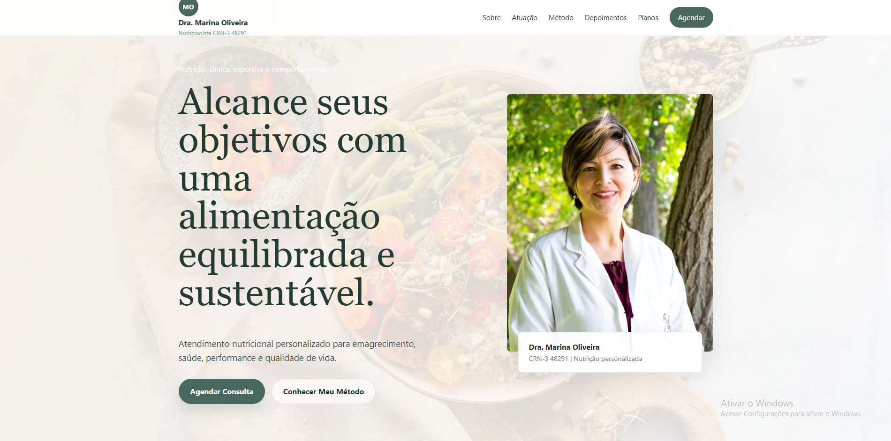

# Dra. Marina Oliveira | Nutricionista

## Sobre o projeto
Landing page profissional desenvolvida para uma nutricionista fictícia, apresentando seus serviços de atendimento nutricional personalizado. O site foi criado para estabelecer presença digital, comunicar credibilidade e facilitar o agendamento de consultas, atendendo tanto pacientes que buscam emagrecimento saudável quanto aqueles que desejam melhorar performance e qualidade de vida.

## Preview

-- ou -- [Ver projeto ao vivo](https://dudamilannnn.github.io/site-nutricionista-2026/)

## Tecnologias utilizadas
- HTML5 (semântico e acessível)
- CSS3 (FlexboxGrid, animações e variáveis CSS)
- JavaScript (ES6+)
- Unsplash API (imagens de alta qualidade)
- Google Fonts (tipografia personalizada)

## Funcionalidades
- Layout 100% responsivo (mobile, tablet e desktop)
- Carrossel de depoimentos com navegação por botões e dots
- Animações de entrada com Intersection Observer (scroll reveal)
- Contador animado de estatísticas
- Formulário de contato com validação em tempo real
- Botão "Voltar ao topo" com scroll suave
- Navegação interna com links âncora
- Componentes interativos sem dependências externas

## O que aprendi / O que pratiquei
Neste projeto pratiquei a construção de uma landing page completa com foco em UX/UI, utilizando JavaScript para criar interações dinâmicas como o carrossel de depoimentos, validação de formulário, animações com Intersection Observer e menu responsivo. Foi desafiador implementar o sistema de contagem animada dos números e garantir que todos os componentes fossem acessíveis, com atributos ARIA e navegação por teclado. Também apliquei boas práticas de SEO com meta tags descritivas e estrutura semântica HTML5

## Como rodar localmente
1. Clone o respositório
```bash
git clone https://github.com/dudamilannnn/site-nutricionista-2026
```
2. Abra o arquivo index.html no navegador

## Autora
Maria Eduarda Milan - Desenvolvedora Web